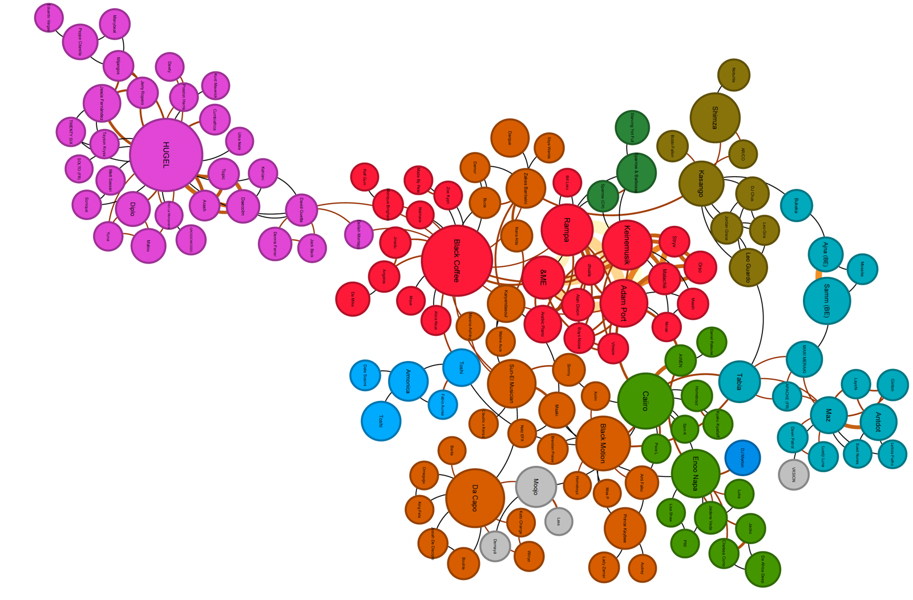

# Data Analysis Portfolio — Kevin Selorm Mensah

Projects in data collection, data cleaning, SQL, big data, BI dashboards, network analysis, and machine learning.

## ⭐ Featured: Afrohouse Global Influence Network (MSc dissertation)
A mixed-methods study using Spotify API data, network analysis (NetworkX, Gephi, Tableau) and a 72-respondent survey. The network has **2,988 artists and 4,744 ties**, with a strong core–periphery structure. Influence comes from **network position and playlist curation, not popularity alone**. Southern Africa and Europe exchange in both directions through broker artists. → [Project](afrohouse-network-analysis/)



## Other projects
| Project | Question | Methods | Key result |
|---|---|---|---|
| [African CO₂ Emissions](africa-co2-emissions/) | How have African emissions changed, and how reliable is the data? | Source register, data dictionary, ISO3 reconciliation, QC flags, change log, country profiles | 613→1,392 Mt (1990–2019); 62% from 3 countries; Côte d'Ivoire gap and Mali anomalies flagged |
| [Employee Attrition Dashboard](hr-attrition-tableau-dashboard/) | Where is attrition concentrated, and what drives it? | Tableau calculated fields, parameters; figures checked in Python | 16.1% attrition; Sales Reps 39.8% rate; overtime triples attrition (30.5% vs 10.4%) |
| [Adidas Sales Dashboard](adidas-sales-dashboard/) | Which regions, retailers, products and channels drive sales and profit? | Tableau parameters (KPI selector, Top N), maps, dual-axis target tracking | One dashboard for 4 stakeholder groups; target-logic flaw identified and redesign proposed |
| [Big Data Pipeline](big-data-hive-spark/) | Can a 5M-row dataset be processed on a distributed stack? | HDFS, Hive on Tez/YARN, PySpark SQL + Spark ML, Docker | 5,015,737 rows aggregated in ~12 s; synthetic-data and outlier issues flagged |
| [Telecom MySQL Database](telecom-mysql-database/) | How should an operator's customers, usage and billing be modelled and queried? | 9-table 3NF schema, ERD, joins, window functions, stored procedure, data-quality checks | 41% of June billing collected; 3 query bugs and 3 data-consistency issues found and fixed |
| [Hospital Management SQL App](hospital-management-sql-app/) | How can hospital operations KPIs be served from a relational database? | SQLite schema, parameterised SQL, Streamlit dashboard, PDF reporting | 6-table database, 5 SQL KPIs, interactive dashboard |
| [A/B Test: Landing Page](ab-test-landing-page/) | Does a redesigned page lift engagement and conversion? | Welch t-test, two-proportion z-test, chi-square, ANOVA | Conversion 66% vs 42% (p = 0.008); roll out the new page |
| [ReneWind: Wind-Turbine Failure Prediction](renewind-turbine-failure-prediction/) | Can sensor data predict generator failures before they happen? | Imbalanced classification, SMOTE/undersampling, 7 models, tuning, cost-based model selection, pipelines | Test recall 0.84, precision 0.89; about 51% lower maintenance cost (assumed cost ratio) |
| [Hotel Cancellation Prediction](hotel-cancellation-prediction/) | Which bookings will cancel, and which policies reduce lost revenue? | Logistic regression (VIF, p-values, odds ratios, threshold tuning), decision trees with pre/post-pruning | Pruned tree: recall 0.85, ROC-AUC 0.93; lead time and special requests are the main drivers |
| [Sensor-Based Quality Prediction](coffee-roasting-quality-prediction/) | Can roasting-machine sensors predict product quality? | Random Forest, Gradient Boosting, XGBoost, tuning, pipelines, leakage check | R² 0.92 on a random split; time-ordered split exposes leakage (R² ≈ 0) |
| [Stock Segmentation](stock-clustering-trade-ahead/) | Which financial profiles exist among 340 NYSE stocks? | Scaling, K-means, hierarchical clustering, profiling | 4 segments; distressed cluster is 72% Energy |
| [Bitcoin Price Forecasting](bitcoin-price-forecasting/) | Can ML predict next-day BTC price? | RFE/LASSO, RF, Linear Regression, KNN, time-ordered evaluation, naive baseline | No model beats "tomorrow = today"; 48% direction accuracy |
| [Social Media Engagement Clustering](social-media-engagement-clustering/) | Which engagement segments exist in a brand's Facebook posts? | Log transform, scaling, elbow method, K-Means vs. hierarchical, PCA | 3 segments; K-Means silhouette 0.346 vs. 0.228 for hierarchical |
| [Mushroom Classification](mushroom-classification/) | Can physical traits predict if a mushroom is poisonous? | EDA, label encoding, 7 classifiers compared | Tree models reach 100% test accuracy; odor alone almost separates the classes |

## Run
Open any notebook in Google Colab or Jupyter. Install the dependencies with:
```bash
pip install -r requirements.txt
```

## Tools
Python (pandas, NumPy, scikit-learn, SciPy/statsmodels, XGBoost, NetworkX, matplotlib, seaborn, Streamlit) · SQL (MySQL, SQLite, HiveQL) · PySpark · Hadoop/HDFS · APIs · Tableau · Gephi · R

## Change log
See [CHANGELOG.md](CHANGELOG.md) ([Word version](Portfolio_Change_Log.docx)).

## Contact
s.kevmens@gmail.com
