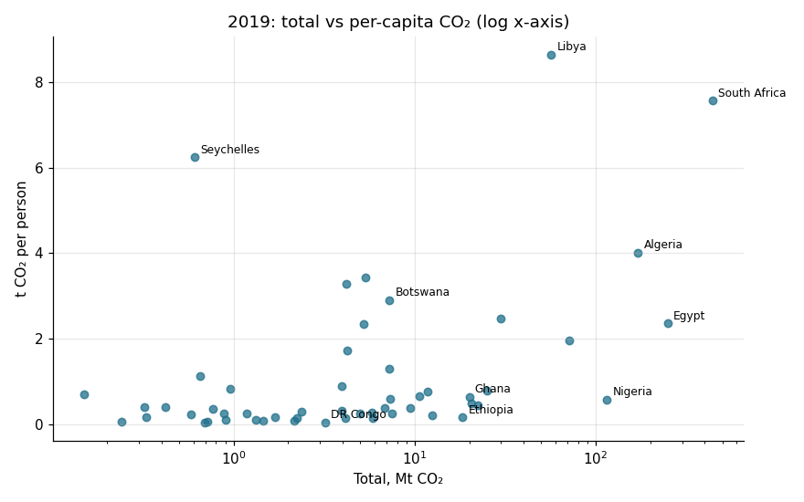
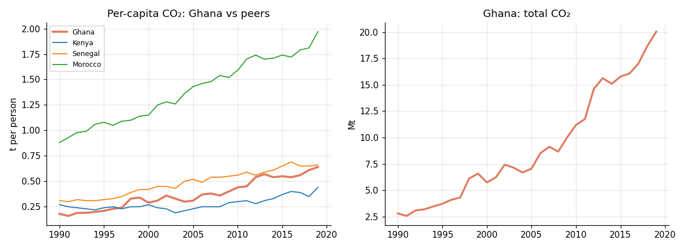

# African CO₂ Emissions, 1990–2019: Cleaning, QC and Country Profiles

Turns a raw global CO₂ dataset into a clean, documented African dataset and analyses it. The workflow mirrors production data work: **source register → data dictionary → standardisation → QC flags → change log → analysis → exports**.

## Data quality findings
| Issue | Handling |
|---|---|
| **Côte d'Ivoire missing** from the source | Gap reported; totals labelled "53 countries" |
| **Mali 1990–97:** 10 kt and 0 t/capita (one year at 0 kt), ~140× below later levels | Set to missing and logged |
| Year gaps: Eritrea 1990–91, Namibia 1990, Mali 1998–99 | Kept as missing; Eritrea and Namibia gaps match independence dates |
| >100% year-on-year jumps: Equatorial Guinea 1992, Benin 1996, Cameroon 1991 | Flagged for checking against the upstream source |
| Country names don't join to other datasets | ISO3 codes added (`pycountry` + manual overrides; 0 unmatched) |

## Results
- Africa (53 countries): **613 → 1,392 Mt CO₂** (×2.3, CAGR 2.9%), 1990–2019
- **62%** of 2019 emissions come from 3 countries (South Africa, Egypt, Algeria); **86%** from the top 10
- Nigeria is the 4th-largest emitter in total but low per capita (0.57 t). Libya, South Africa and Seychelles lead per capita.
- **Ghana:** 2.8 → 20.0 Mt (×7.2). Per capita 0.18 → 0.64 t. Ranked 9th of 32 for growth over 2000–19.

## Outputs (`data/clean/`)
`africa_co2_clean.csv` · `data_dictionary.csv` · `qc_log.csv` · `change_log.csv` · `source_register.csv`

## Limitations / next steps
- The upstream source is not documented. Next: reconcile against Global Carbon Project / Our World in Data by ISO3 and quantify the differences.
- There is no sector split. Next: join Ember electricity data to separate power-sector emissions.
- Per-capita values are rounded to 2 dp, which limits the consistency checks for low emitters.
