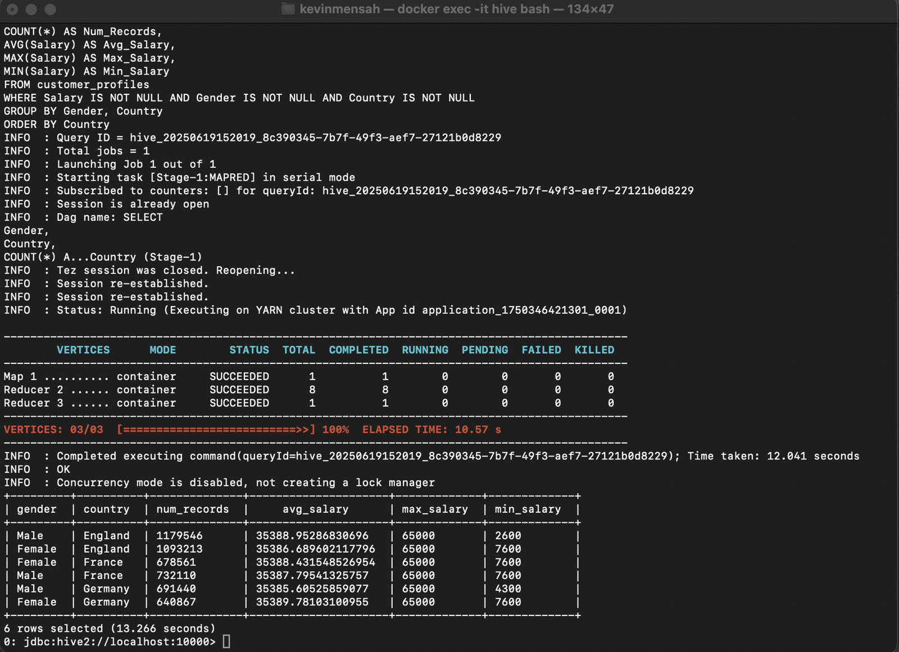
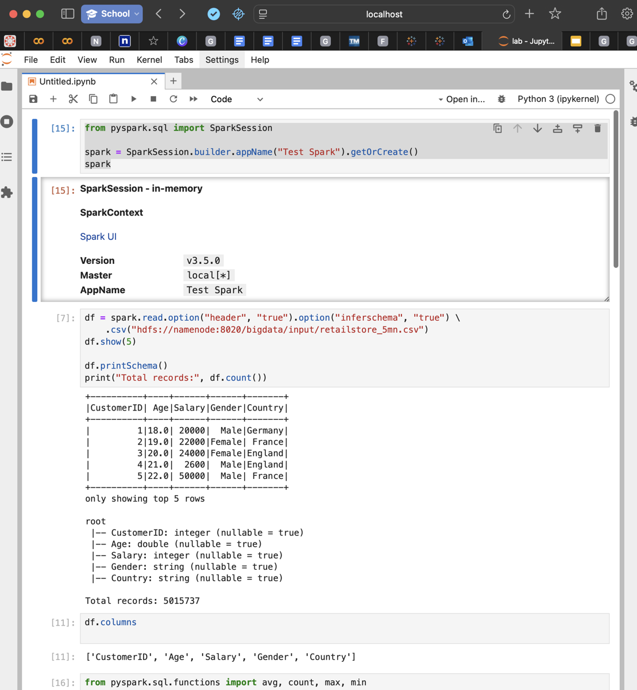

# Big Data Pipeline: Hadoop, Hive and PySpark

**Goal:** Process a 5-million-row retail customer dataset on a Dockerised Hadoop stack: store it in HDFS, query it with Hive (Tez on YARN), then repeat the analysis and add an ML pipeline in PySpark (local mode, reading from HDFS).

## Stack
| Layer | Image / version |
|---|---|
| HDFS | Hadoop 3.2.1 (`bde2020/hadoop-namenode`, `bde2020/hadoop-datanode`) |
| Query | Hive 3.1.3 (`apache/hive`), HiveServer2 + Beeline, Tez on YARN |
| Processing / ML | PySpark (Spark SQL, Spark ML) in `jupyter/pyspark-notebook` |
| Runtime | Docker Engine v24+, Docker Compose, macOS on ARM |

*Course project: Big Data Analytics (2025).*

## Steps
1. Loaded `retailstore_5mn.csv` (5,015,737 rows: CustomerID, Age, Salary, Gender, Country) into HDFS.
2. **Hive** ([`hive_query.sql`](hive_query.sql)): defined an external table over HDFS, then ran a NULL-safe aggregation by gender and country. On Tez it used 1 map task and 9 reducers and finished in about 12 s.
3. **PySpark** ([`spark_pipeline.py`](spark_pipeline.py)): ran the same aggregation through the DataFrame API, then built a Spark ML pipeline (StringIndexer → OneHotEncoder → VectorAssembler → LogisticRegression) to classify salary > 45k. Accuracy: 80%.

## Spark vs Hive (same aggregation)
| | PySpark | Hive |
|---|---|---|
| Interface | Python DataFrame API | HiveQL |
| Run time | ~3 s | ~12 s |
| Output | identical | identical |
| Best use | ML and iterative work | scheduled batch SQL / ETL |

The comparison is indicative only: one run each, and the Hive time includes Tez container start-up.

## Problems solved
- **HDFS permissions:** HiveServer2 threw `AccessControlException`. It needed read access to `/bigdata/input` and traverse (execute) permission on every parent directory up to `/`.
- **ARM compatibility:** some images needed an explicit `platform` setting on Apple Silicon.
- **Container networking:** Beeline-to-HiveServer2 connection fixed by using container names and correct port bindings.

## Data-quality observations
- **Synthetic data:** average salary is about 35,387 in every gender × country group, varying by less than 0.02%.
- **Data-entry error:** CustomerID 4 has a salary of 2,600. The first five rows go 20,000 → 22,000 → 24,000 → **2,600** → …, which points to a dropped zero (26,000). This one row sets the Male/England minimum; every other group's minimum is between 4,300 and 7,600. A range check (for example, salary < 5,000) would catch it.

## Limitations
The 80% accuracy has to be compared with the majority-class baseline (the share of salaries ≤ 45k). With identical salary distributions across groups, the features carry almost no signal, so the model probably predicts the majority class. The value of this project is the distributed pipeline, not the model.
