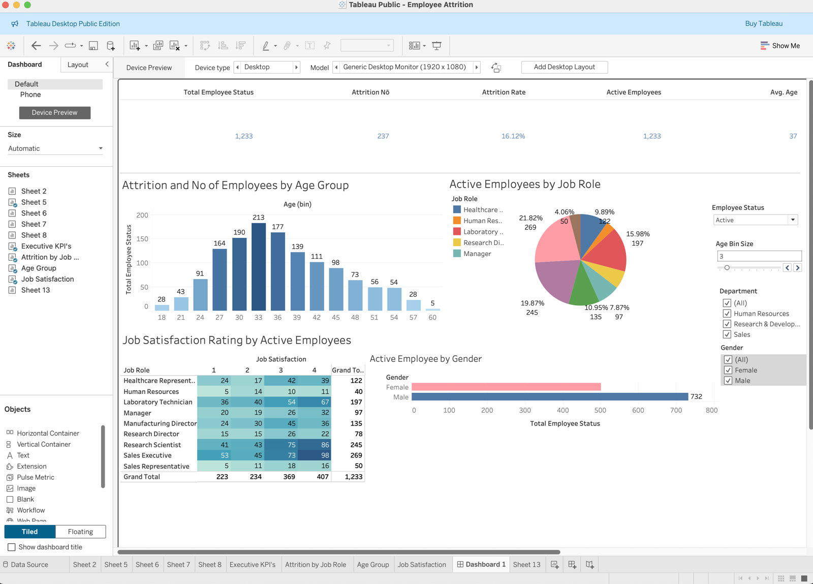
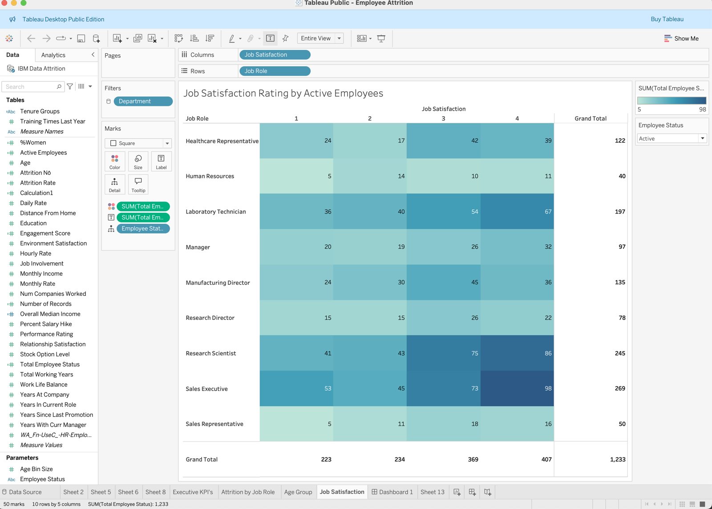

# Employee Attrition Dashboard (Tableau)

**Question:** Where is employee attrition concentrated, and how satisfied are the employees who stay?

**Data:** IBM HR Analytics Employee Attrition dataset (1,470 employees, 35 attributes).



## KPIs
| KPI | Value |
|---|---|
| Employees who left | 237 |
| Attrition rate | **16.12%** |
| Active employees | 1,233 |
| Average age | 37 |

## Calculated fields
```
Attrition Nō         = IF [Attrition1] = "Yes" THEN 1 ELSE 0 END
Attrition Rate       = SUM([Attrition Nō]) / SUM([Number of Records])
Active Employees     = SUM([Number of Records]) - SUM([Attrition Nō])
Income Benchmark     = IF [Monthly Income] >= [Overall Median Income] THEN "Above Median" ELSE "Below Median" END
Total Employee Status= IF [Employee Status]="Active" AND [Attrition1]="No" THEN 1
                       ELSEIF [Employee Status]="Attrition" AND [Attrition1]="Yes" THEN 1 ELSE 0 END
```
- The **`Employee Status` parameter** switches every chart between active and departed employees.
- The **`Age Bin Size` parameter** lets the user resize the age histogram bins.
- **Other derived fields:** tenure groups, age bands, % women, and an engagement score.

## Insights
- **Age:** the workforce peaks at ages 30–38 (213 employees in the 33–35 bin).
- **Job satisfaction:** 63% of active staff rate it 3 or 4. Sales Executives and Research Scientists have the most "4" ratings, but Sales Executives also have the most "1" ratings (53), so that role is the most polarised.
- **Largest active roles:** Sales Executive (269), Research Scientist (245) and Laboratory Technician (197).



## Design notes / next iteration
- Replace the 9-slice pie chart with a sorted bar chart, which is easier to compare across roles.
- Add attrition rate by role, overtime and income band (`Income Benchmark`). These are the main attrition drivers in this dataset.
