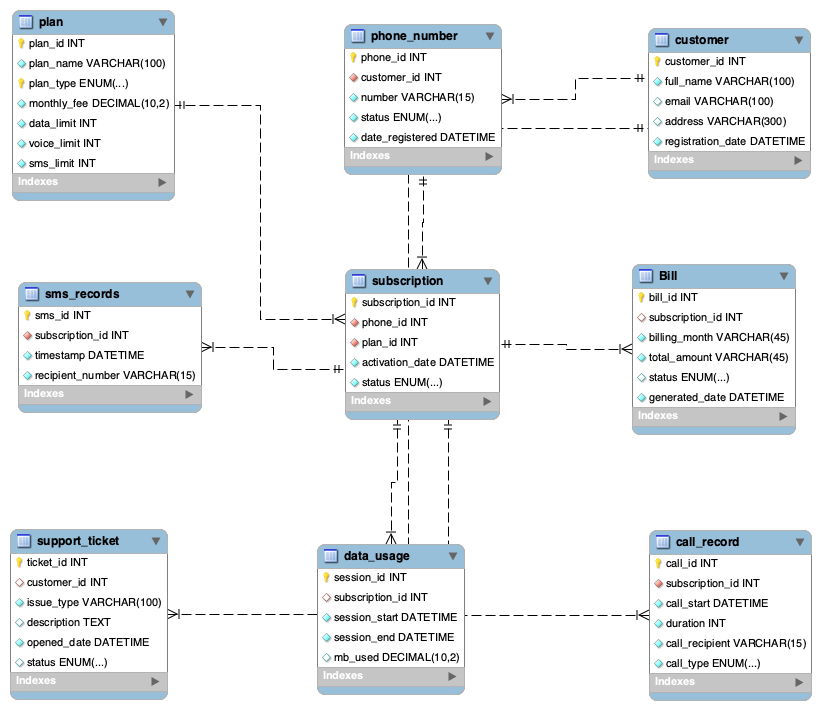

# Telecom Customer & Billing Database (MySQL)

**Goal:** Design a normalised relational database for a mobile network operator (customers, numbers, plans, subscriptions, usage, billing, support), load realistic Ghana-based sample data, and answer business questions in SQL.

*Course project: Enterprise Data Warehousing & Database Management Systems (2025).*

## Schema (9 tables, 3NF)
- **Core:** `customer` 1─* `phone_number` 1─* `subscription` *─1 `plan`
- **Usage (per subscription):** `call_record`, `sms_record`, `data_usage`
- **Finance & service:** `bill` (per subscription), `support_ticket` (per customer)
- Integrity: primary and foreign keys, `NOT NULL`, `UNIQUE` phone numbers, `ENUM` status fields, `DECIMAL` for money.

## Files
| File | Content |
|---|---|
| [`01_schema_and_data.sql`](01_schema_and_data.sql) | DDL + sample data (30 customers, 36 numbers/subscriptions, 5 plans, ~200 usage, bill and ticket rows) |
| [`02_analysis_queries.sql`](02_analysis_queries.sql) | 11 business queries + stored procedure |
| [`03_data_quality_checks.sql`](03_data_quality_checks.sql) | Consistency checks on the sample data |

Tested on MariaDB 10 / MySQL 8 syntax: `mysql < 01_schema_and_data.sql`, then run 02 and 03.

## Results (June 2025 billing)
| Question | Answer |
|---|---|
| Most popular plan | made4me (12 subscriptions), then just4you (10) |
| Total billed | 1,098.30 |
| Collected | **41.4% paid**; 33.9% unpaid, 24.6% overdue |
| Revenue by plan type | postpaid 584.48 vs prepaid 513.82 |
| Active customers | 22 of 30 (8 have no active subscription) |
| Least-resolved ticket type | SIM Registration (5 of 6 unresolved) |
| Highest data use | made4me in total; superbrowse per session (165.5 MB) |

**Business takeaway:** almost 59% of June billing is still outstanding, so collections is the main revenue risk, ahead of plan mix.

## Query fixes made during review
| Query | Problem in first version | Fix |
|---|---|---|
| Active customers | `COUNT(customer_id)` counted subscriptions (24) | `COUNT(DISTINCT …)` → 22 |
| Inactive customers | LEFT JOIN at phone level listed customers who had an active sub on another number, plus duplicates (12 rows) | `NOT EXISTS` at customer level → 8 |
| Stored procedure | `'%y-%m'` gives `25-06`, never matches `2025-06`, so every customer was returned | `'%Y-%m'`, `NOT EXISTS`, `DISTINCT`, closing `DELIMITER ;` |
| Most support tickets | Every customer has exactly 1 ticket, so "top 3" was an arbitrary tie | Replaced with tickets by issue type and resolution status |
| Revenue label | Column named `total_revenue_may`, but bills are June | Grouped by `billing_month` |

## Data-quality findings (sample data)
- 11 of 36 bills differ from the plan fee by more than 15 (for example a just4you plan at 49.99 billed 17.99).
- 14 subscriptions are activated before their phone number was registered.
- 6 active subscriptions sit on suspended or ported numbers.
- The ERD is older than the script: `Bill.total_amount` is `VARCHAR` in the diagram but `DECIMAL` in the DDL, and `sms_record` gained `message_type` and `direction`.

In production these would become constraints or triggers (bill amount derived from plan + usage; activation date ≥ registration date).
